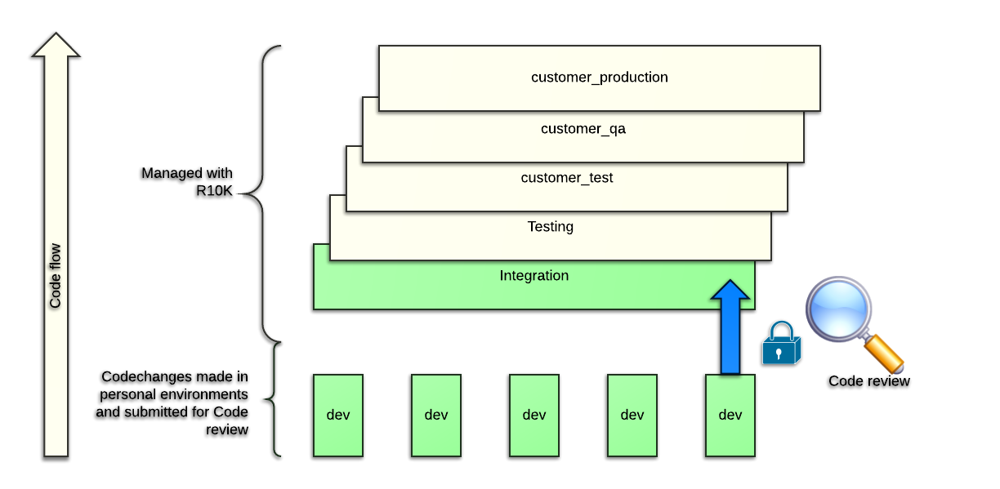

#R10K


#Links
* [R10k docs](https://github.com/puppetlabs/r10k/blob/master/doc/puppetfile.mkd)
* [puppet/r10k module](https://forge.puppet.com/puppet/r10k)
* [Bash git prompt](https://github.com/magicmonty/bash-git-prompt)

#Example Puppetfile
```
mod 'camptocamp/augeas', '1.6.0'
mod 'camptocamp/puppetserver', '2.1.0'
mod 'herculesteam/augeasproviders_core', '2.1.3'
mod 'puppetlabs/apt', '2.3.0'
mod 'puppetlabs/concat', '2.2.0'
mod 'puppetlabs/firewall', '1.8.2'
mod 'puppetlabs/inifile', '1.6.0'
mod 'puppetlabs/postgresql', '4.8.0'
mod 'puppetlabs/puppetdb', '5.1.2'
mod 'puppetlabs/stdlib', '4.15.0'

mod "role",
  :git => "git@gitlab.puppetspecialist.nl:puppet/role.git",
  :ref => "HEAD"

mod "profile",
  :git => "git@gitlab.puppetspecialist.nl:puppet/profile.git",
  :ref => "HEAD"
```
# Puppetfile after adding R10k modules
```
mod 'camptocamp/augeas', '1.6.0'
mod 'camptocamp/puppetserver', '2.1.0'
mod 'gentoo/portage', '2.3.0'
mod 'herculesteam/augeasproviders_core', '2.1.3'
mod 'puppet/make', '1.1.0'
mod 'puppet/r10k', '4.1.0'
mod 'puppetlabs/apt', '2.3.0'
mod 'puppetlabs/concat', '2.2.0'
mod 'puppetlabs/firewall', '1.8.2'
mod 'puppetlabs/gcc', '0.3.0'
mod 'puppetlabs/git', '0.5.0'
mod 'puppetlabs/inifile', '1.6.0'
mod 'puppetlabs/pe_gem', '0.2.0'
mod 'puppetlabs/postgresql', '4.8.0'
mod 'puppetlabs/puppetdb', '5.1.2'
mod 'puppetlabs/ruby', '0.6.0'
mod 'puppetlabs/stdlib', '4.15.0'
mod 'puppetlabs/vcsrepo', '1.5.0'

mod "role",
  :git => "git@gitlab.puppetspecialist.nl:puppet/role.git",
  :ref => "HEAD"

mod "profile",
  :git => "git@gitlab.puppetspecialist.nl:puppet/profile.git",
  :ref => "HEAD"
```
# Environments

